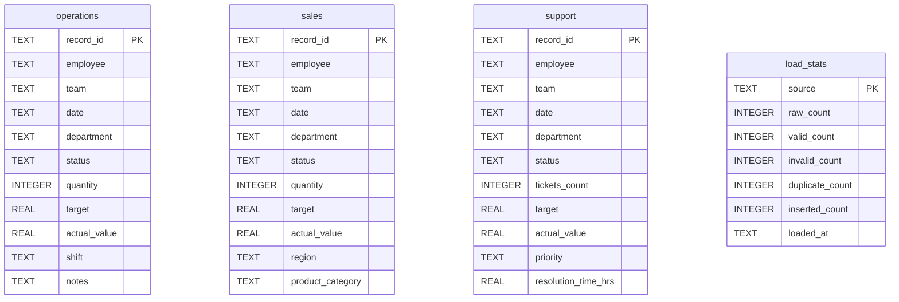

# Workflow Automation for Operational Reporting
## Complete Application Implementation & Logic Guide

---

## 1. Document Purpose

This document provides a complete, authoritative technical reference for the **Workflow Automation for Operational Reporting** application. It serves as an end-to-end engineering specification and logic guide derived directly from the active source code, SQL definitions, configuration files, test suites, and sample data in the repository.

### Intended Audiences

1. **Software Engineers & Developers**: Provides a complete function-by-function and query-by-query breakdown so new developers can understand, maintain, and extend the system without reverse-engineering the codebase.
2. **AI Coding Agents**: Serves as an authoritative architectural context map, defining exact file responsibilities, parameter schemas, dependency graphs, and modification entry points.
3. **Data & Operations Analysts**: Explains the data-quality pipeline, data-lifecycle transformations, record classification rules, status normalization mappings, and multi-level reconciliation formulas.

---

## 2. Project Overview

The **Workflow Automation for Operational Reporting** application is a zero-external-dependency Python and SQLite data pipeline designed to ingest, validate, normalize, reconcile, and report on daily operational data from multiple disparate business departments (**Operations**, **Sales**, and **Support**).

### Key Architectural Highlights

- **Standard Library Implementation**: Built entirely using Python's standard library (`sqlite3`, `csv`, `os`, `sys`, `datetime`, `logging`, `urllib.request`). No external pip packages are required.
- **Idempotent Data Ingestion**: Re-executing the workflow clears existing database contents and re-ingests raw CSV files cleanly, preventing duplicate records across pipeline runs.
- **Data Quality Safeguard**: Invalid records and duplicate record IDs are logged, categorized, and intentionally excluded from reporting tables.
- **Unified Status Normalization**: SQL Views normalize heterogeneous status terms across departments (`Completed`, `Closed`, `Resolved` → `Completed`; `In Progress`, `Pipeline`, `Pending` → `Pending`; `Failed`, `Lost`, `Escalated` → `Failed`).
- **Independent 5-Level Reconciliation Audit**: Independent Python assertions verify raw CSV counts against database rows and SQL calculation outputs before report generation proceeds.
- **Multi-Channel Delivery**: Generates styled, self-contained HTML reports, automatically launches default web browsers, and optionally publishes report pages to Atlassian Confluence Cloud via REST API.
- **Automated Scheduling**: Includes a background scheduler with configurable run times, interval testing overrides, `--once` test flags, and offline catch-up execution logic.

---

## 3. Business Problem

Prior to automation, operational reporting across Operations, Sales, and Support was performed through manual spreadsheet consolidation. This legacy manual process introduced critical business challenges:

1. **High Operational Overhead**: Manual data collection, header alignment, VLOOKUP/SUM formula creation, exception flagging, and email report distribution consumed an estimated **12 hours per week** of senior engineering/operations time.
2. **Inconsistent Status Terminology**: Operations evaluated work by `Completed`/`In Progress`/`Failed`, Sales tracked deals by `Closed`/`Pipeline`/`Lost`, and Support measured tickets by `Resolved`/`Pending`/`Escalated`. Without central normalization, cross-department visibility was impossible.
3. **Risk of Bad Data Ingestion**: Empty fields, corrupted date strings, malformed numbers, and duplicate record IDs in incoming CSVs corrupted summary metrics and distorted executive KPIs.
4. **Lack of Auditability**: Manual spreadsheet updates lacked automated verification, making it difficult to prove whether summary counts accurately reflected raw source files.

---

## 4. What the Application Does

The application automates the end-to-end operational reporting lifecycle:

```text
+-----------------------------------------------------------------------------------+
| 1. Ingests raw CSV files from Operations, Sales, and Support departments.         |
| 2. Validates headers, required fields, date formats (YYYY-MM-DD), and data types.|
| 3. Separates records into Valid, Rejected (invalid), and Duplicate categories.    |
| 4. Stores valid records into SQLite (`database/reporting.db`) idempotently.       |
| 5. Normalizes status categories across all departments via a unified SQL View.   |
| 6. Executes independent 5-level Python vs. SQL data reconciliation audits.        |
| 7. Generates an 8-section HTML report (`reports/operational_report_*.html`).      |
| 8. Opens the report in the user's default browser and optionally posts to Confluence.|
| 9. Runs continuously via an automated scheduler (`scheduler.py`) with catch-up.  |
+-----------------------------------------------------------------------------------+
```

---

## 5. Complete End-to-End Flow

The actual runtime execution order across all modules and functions is illustrated below:

```text
[User / Command Line / Scheduler]
               │
               ▼
       main.py : main()
               │
               ├──────► Step 1: step_verify_sources(logger)
               │                 └─ Checks data/operations.csv, sales.csv, support.csv exist.
               │
               ├──────► Step 2a: step_setup_database(logger)
               │                 └─ Calls setup_database.setup_database() -> executes sql/schema.sql
               │
               ├──────► Step 2b: step_load_data(logger)
               │                 └─ Calls load_data.main()
               │                     └─ Calls load_csv_to_table() for operations, sales, support
               │                         ├─ validate_columns()
               │                         ├─ Deduplication (seen_ids set)
               │                         ├─ validate_row() (dates, ints, floats)
               │                         ├─ Database INSERT OR IGNORE
               │                         └─ Stores metrics in load_stats table
               │
               ├──────► Step 3: step_confirm_database(logger)
               │                 └─ Verifies SQLite tables contain non-zero valid records.
               │
               ├──────► Step 4: step_run_reports(logger)
               │                 └─ Calls run_reports.main()
               │                     ├─ ensure_view() -> Creates SQL View v_all_records
               │                     └─ Executes terminal summary queries & prints outputs
               │
               ├──────► Step 4b: reconcile.reconcile_all(PROJECT_ROOT, logger)
               │                 ├─ Level 1: CSV Row Inspection
               │                 ├─ Level 2: DB Row Count & Math (RAW = VALID + REJECTED + DUP)
               │                 ├─ Level 3: Python vs. SQL Aggregate Calculations
               │                 ├─ Level 4: Operational Exceptions Audit
               │                 └─ Aborts workflow if reconciliation fails
               │
               ├──────► Step 5: step_generate_report(logger)
               │                 └─ Calls generate_report.generate_report()
               │                     ├─ collect_report_data() -> Executes SQL queries
               │                     ├─ generate_html() -> Compiles HTML report
               │                     ├─ Saves report to reports/operational_report_*.html
               │                     └─ Launches default web browser via webbrowser.open()
               │
               └──────► Step 5b: confluence_publisher.publish_to_confluence()
                                 └─ Reads .env -> Sends REST API HTTP PUT/POST or safely skips.
```

---

## 6. Complete Data Lifecycle

This master data-lifecycle map traces how an individual data record transforms from an unparsed CSV string into database rows, SQL metrics, reconciliation assertions, and HTML report components.

```text
Raw CSV Line: "OPS-0001,John Doe,Team Alpha,2026-09-01,Manufacturing,Completed,100,500.0,480.0,Morning,Optimal run"
   │
   ▼
[DictReader & Whitespace Stripping]
   │  Keys & Values trimmed (.strip())
   ▼
Parsed Dictionary:
   {
     "record_id": "OPS-0001", "employee": "John Doe", "team": "Team Alpha",
     "date": "2026-09-01", "department": "Manufacturing", "status": "Completed",
     "quantity": "100", "target": "500.0", "actual_value": "480.0",
     "shift": "Morning", "notes": "Optimal run"
   }
   │
   ▼
[Deduplication Check]
   │  Is "OPS-0001" in seen_ids?
   ├───── YES ──► Category: DUPLICATE ──► Logged & Skipped (duplicate_count += 1)
   │
   NO
   ▼
[Validation Engine: validate_row()]
   │  1. Check required fields present & non-empty
   │  2. Validate date format (YYYY-MM-DD via datetime.strptime)
   │  3. Validate integer fields (int(value))
   │  4. Validate float fields (float(value))
   │
   ├───── INVALID ──► Category: REJECTED ──► Logged & Skipped (invalid_count += 1)
   │
   VALID
   ▼
[Type Conversion & Tuple Construction]
   Tuple: ('OPS-0001', 'John Doe', 'Team Alpha', '2026-09-01', 'Manufacturing',
           'Completed', 100, 500.0, 480.0, 'Morning', 'Optimal run')
   │
   ▼
[Database Loading: SQLite INSERT]
   INSERT INTO operations (...) VALUES (...) ──► Category: VALID
   │
   ▼
[Data Ingestion Summary: load_stats Table]
   INSERT INTO load_stats VALUES ('operations', 1005, 1000, 4, 1, 1000, timestamp)
   │
   ▼
[SQL Status Normalization View: v_all_records]
   status="Completed" ──► status_category="Completed"
   source="operations"
   │
   ▼
[SQL Aggregation & Exception Queries]
   SUM(target) = 125710.0, SUM(actual_value) = 114458.9, completion_pct = 79.4%
   │
   ▼
[Python Reconciliation Audit: reconcile.py]
   Assert: RAW (1005) == VALID (1000) + REJECTED (4) + DUPLICATE (1)  [PASS]
   Assert: VALID (1000) == DB ROWS (1000)                             [PASS]
   Assert: Python Completed Count == SQL Completed Count             [PASS]
   │
   ▼
[HTML Report Generation & Display]
   Rendered into Executive Summary & Department Performance tables in HTML report.
```

### Transformation Step Breakdown

| Transformation | Input State | Processing Function / File | Output State | Technical / Business Reason | Failure Behavior |
| --- | --- | --- | --- | --- | --- |
| **String Trimming** | `" OPS-0001 "` | `load_data.py` (DictReader loop) | `"OPS-0001"` | Prevents whitespace mismatches in keys, IDs, and status values. | Retains un-trimmed string if not called. |
| **Header Check** | `['record_id', 'employee', ...]` | `validate_columns()` | `True` / `False` | Ensures CSV file conforms to required schema before reading rows. | File skipped; `empty_stats` returned. |
| **Date Parsing** | `"2026-09-01"` | `validate_date()` | `True` / `False` | Guarantees SQL queries can perform date sorting and grouping. | Row marked `REJECTED`; `invalid_count` incremented. |
| **Numeric Parsing** | `"500.0"` | `validate_float()` | `500.0` (float) | Converts raw string into numeric data types required for SQL mathematical aggregations. | Row marked `REJECTED`; `invalid_count` incremented. |
| **Deduplication** | `"OPS-0001"` | `load_csv_to_table()` | Added to `seen_ids` | Prevents duplicate primary key insertion and double-counting in reports. | Duplicate row marked `DUPLICATE`; `duplicate_count` incremented. |
| **Status Mapping** | `"Closed"` (Sales) | `v_all_records` View | `"Completed"` | Unifies department-specific terminology into standard categories. | Unmapped status falls back to `"Unknown"`. |

---

## 7. Source Data Structure

The application ingests three daily CSV files located in `data/`:

### 1. Operations CSV (`data/operations.csv`)
- **Primary Domain**: Production, logistics, manufacturing, and quality control.
- **Required Columns**: `record_id`, `employee`, `team`, `date`, `department`, `status`, `quantity`, `target`, `actual_value`
- **Optional Columns**: `shift`, `notes`
- **Domain Status Values**: `Completed`, `In Progress`, `Failed`

### 2. Sales CSV (`data/sales.csv`)
- **Primary Domain**: Commercial sales pipeline and monetary revenue performance.
- **Required Columns**: `record_id`, `employee`, `team`, `date`, `department`, `status`, `quantity`, `target`, `actual_value`
- **Optional Columns**: `region`, `product_category`
- **Domain Status Values**: `Closed`, `Pipeline`, `Lost`
- **Unit Difference**: `target` and `actual_value` represent monetary revenue in USD ($).

### 3. Support CSV (`data/support.csv`)
- **Primary Domain**: Customer support ticket volumes and SLA resolution metrics.
- **Required Columns**: `record_id`, `employee`, `team`, `date`, `department`, `status`, `tickets_count`, `target`, `actual_value`
- **Optional Columns**: `priority`, `resolution_time_hrs`
- **Domain Status Values**: `Resolved`, `Pending`, `Escalated`
- **Column Variant**: Primary item count column is named `tickets_count` instead of `quantity`.

---

## 8. Application Entry Point

The application entry point is `main.py`. It coordinates execution across all pipeline modules and maintains the single top-level workflow logger.

### Core Workflow Execution Sequence in `main.py`

```python
def main():
    logger, log_file = setup_logger()
    try:
        step_verify_sources(logger)        # Step 1: Confirm source CSV files exist
        step_setup_database(logger)        # Step 2a: Ensure SQLite DB and tables exist
        step_load_data(logger)             # Step 2b: Validate and load CSVs into SQLite
        counts = step_confirm_database(logger) # Step 3: Verify DB contains loaded rows
        step_run_reports(logger)           # Step 4: Run SQL reporting (terminal output)
        reconcile.reconcile_all(...)       # Step 4b: Multi-level Python vs SQL audit
        report_path = step_generate_report(logger) # Step 5: Build HTML report & open browser
        confluence_publisher.publish_to_confluence(...) # Step 5b: Publish to Confluence (optional)
        status = "SUCCESS"
    except Exception as e:
        status = "FAILED"
```

---

## 9. Input File Processing

Input file discovery and reading is managed by `load_data.py`.

### Discovery & Validation Logic

1. **Path Construction**: Constructs absolute paths using `os.path.join(data_dir, config["csv_file"])`.
2. **File Existence Check**: Uses `os.path.exists()`. If missing, logs an error and returns zero stats without crashing.
3. **Encoding & Headers**: Opens CSV files using `utf-8` encoding. Uses `csv.DictReader` to parse header column names.
4. **Header Normalization**: Strips leading and trailing whitespace from every header string (`header = [h.strip() for h in header]`).
5. **Column Integrity Check**: Calls `validate_columns()`. If mandatory required columns are missing, skips the entire file.

---

## 10. Data Validation

Validation takes place row-by-row inside `validate_row()` in `scripts/load_data.py`.

```text
Row Dict
   │
   ├─► Check Required Fields ──► Any field missing or empty after .strip()? ──► REJECT
   │
   ├─► Validate Date Format  ──► Cannot parse YYYY-MM-DD via strptime?      ──► REJECT
   │
   ├─► Validate Integers     ──► int(value) raises ValueError/TypeError?     ──► REJECT
   │
   └─► Validate Floats       ──► float(value) raises ValueError/TypeError?   ──► REJECT
   │
   ▼
[VALID RECORD]
```

### Validation Helper Functions

- `validate_columns(header, required_columns, table_name, logger)`: Verifies all mandatory column names exist in the CSV header list.
- `validate_date(value, field, row_id, table_name, logger)`: Executes `datetime.strptime(value, "%Y-%m-%d")`. Returns `False` on format mismatch.
- `validate_integer(value, field, row_id, table_name, logger)`: Executes `int(value)`. Returns `False` if non-integer characters are present.
- `validate_float(value, field, row_id, table_name, logger)`: Executes `float(value)`. Handles optional empty float columns appropriately.

---

## 11. Data Type Conversion

Converting raw string CSV inputs into strongly-typed Python values prevents type mismatch errors during database insertion and SQL aggregation:

```python
values = []
for col in config["column_order"]:
    raw = row.get(col, "")
    if col in config["integer_columns"]:
        values.append(int(raw))
    elif col in config["float_columns"]:
        values.append(float(raw) if raw else None)
    else:
        values.append(raw if raw else None)
```

- **Integers**: Converted using `int(raw)`. Stored in SQLite as `INTEGER`.
- **Floats**: Converted using `float(raw)` if populated, otherwise `None`. Stored in SQLite as `REAL`.
- **Strings**: Stripped of whitespace (`raw.strip()`). Stored in SQLite as `TEXT`. Empty optional strings become `None` (`NULL`).

---

## 12. Record Classification

Every raw record read from a source CSV file is evaluated and categorized into exactly one of three mutually exclusive classifications:

```text
RAW RECORD READ FROM CSV
          │
          ├── Is record_id already in seen_ids set?
          │         └── YES ──► Category: DUPLICATE (Skipped & Counted)
          │
          └── NO
               │
               ├── Does validate_row() pass all checks?
               │         ├── YES ──► Category: VALID (Inserted into SQLite)
               │         └── NO  ──► Category: REJECTED / INVALID (Skipped & Counted)
```

### Classification Definitions

1. **Valid**: Record contains all required fields, valid dates, and valid numbers, and possesses a unique record ID within the file.
2. **Rejected (Invalid)**: Record fails field presence, date format, or numeric data type validation rules.
3. **Duplicate**: Record possesses a `record_id` that was already processed earlier in the same source file.

---

## 13. Duplicate Detection

Duplicate detection operates in `load_csv_to_table()` using an in-memory Python `set` named `seen_ids`:

```python
seen_ids = set()
for row_num, row in enumerate(reader, start=2):
    record_id = row.get("record_id", "").strip()
    if record_id in seen_ids:
        logger.warning(f"[{table_name}] Row {row_num}: Duplicate record_id '{record_id}' -- skipping.")
        duplicate_count += 1
        continue
    seen_ids.add(record_id)
```

### Why Separate Duplicates from General Invalid Records?

1. **Root-Cause Analysis**: Distinguishes upstream data-export issues (accidental duplicate CSV rows) from data corruption issues (malformed date/number strings).
2. **Reconciliation Accounting**: Allows the reconciliation framework to verify raw file line counts exactly (`RAW = VALID + REJECTED + DUPLICATE`).

---

## 14. Rejected Record Handling

Invalid and duplicate records are intentionally **excluded** from insertion into database tables:

1. **Exclusion**: The row loop calls `continue`, skipping SQL `INSERT` execution for that row.
2. **Logging**: Detailed warning messages are logged to `logs/load_data_*.log` specifying the exact row number, record ID, column name, and failure reason.
3. **Metrics Tracking**: Increments `invalid_count` or `duplicate_count` metrics.
4. **Audit Persistence**: Writes final load statistics into the SQLite `load_stats` table for tracking.

---

## 15. Valid Record Handling

When a record passes validation and deduplication:

1. **Tuple Mapping**: Construct a tuple matching the table's `column_order`.
2. **Database Insertion**: Execute parameterized `INSERT OR IGNORE INTO <table> VALUES (?, ?, ...)` statement.
3. **Counter Increment**: Increment `valid_count`.
4. **Transaction Commit**: Commit valid table rows and `load_stats` metrics to the database.

---

## 16. Database Loading & Idempotency

Database loading is handled in `scripts/load_data.py`.

### Idempotent Design Pattern

To guarantee idempotency (enabling the pipeline to run repeatedly without accumulating duplicate records):

```python
# Clear existing table data to ensure idempotent data loads
conn.execute(f"DELETE FROM {table_name}")
```

Before loading each CSV, `load_csv_to_table()` clears the destination SQLite table using `DELETE FROM <table>`. Running the data load multiple times produces identical, predictable database states.

---

## 17. Database Schema

The SQLite database file is located at `database/reporting.db`. The Data Definition Language (DDL) is defined in `sql/schema.sql`.



---

## 18. SQL Reporting

Phase 2 SQL reporting is driven by `scripts/run_reports.py` and uses queries defined in `sql/reporting_queries.sql`.

### Query Architecture

- **View Creation**: Executes `ensure_view()`, which creates the unified view `v_all_records`.
- **Inline Query Execution**: `run_reports.py` executes specialized SELECT queries against `v_all_records`.
- **Row Factory Usage**: Sets `conn.row_factory = sqlite3.Row` to enable column access by name.
- **Terminal Summary Printing**: Formats query output into text tables printed to the console and saved in logs.

---

## 19. Status Normalization

Different departments use domain-specific terms to represent operational work states. SQL View `v_all_records` normalizes these disparate terms into three standard categories:

| Department Source | Domain Raw Statuses | Standardized `status_category` |
| --- | --- | --- |
| **Operations** | `Completed` | `Completed` |
| **Sales** | `Closed` | `Completed` |
| **Support** | `Resolved` | `Completed` |
| **Operations** | `In Progress` | `Pending` |
| **Sales** | `Pipeline` | `Pending` |
| **Support** | `Pending` | `Pending` |
| **Operations** | `Failed` | `Failed` |
| **Sales** | `Lost` | `Failed` |
| **Support** | `Escalated` | `Failed` |
| *Any Table* | *Unrecognized Status String* | `Unknown` |

### SQL `CASE` Mapping Logic

```sql
CASE
    WHEN status IN ('Completed', 'Closed', 'Resolved') THEN 'Completed'
    WHEN status IN ('In Progress', 'Pipeline', 'Pending') THEN 'Pending'
    WHEN status IN ('Failed', 'Lost', 'Escalated')       THEN 'Failed'
    ELSE 'Unknown'
END AS status_category
```

---

## 20. Department-Level Processing

While tables are combined for overall metrics, department-specific nuances are preserved:

- **Operations**: Tracks units processed (`quantity`), shift assignments, and operational notes.
- **Sales**: Measures revenue volume ($) for target and actual values, tracking regional channels (`region`) and product lines.
- **Support**: Measures ticket resolution counts (`tickets_count`), ticket priority levels, and resolution SLA times (`resolution_time_hrs`).

---

## 21. Unified Reporting

The SQL View `v_all_records` combines all three departmental tables using `UNION ALL`:

```sql
CREATE VIEW v_all_records AS
SELECT record_id, employee, team, date, department, status,
       CASE ... END AS status_category,
       quantity AS item_count, target, actual_value, 'operations' AS source
FROM operations
UNION ALL
SELECT record_id, employee, team, date, department, status,
       CASE ... END AS status_category,
       quantity AS item_count, target, actual_value, 'sales' AS source
FROM sales
UNION ALL
SELECT record_id, employee, team, date, department, status,
       CASE ... END AS status_category,
       tickets_count AS item_count, target, actual_value, 'support' AS source
FROM support;
```

---

## 22. Reconciliation Logic

Multi-level data reconciliation is implemented in `scripts/reconcile.py`. It executes 5 verification checks before reporting completes.

```text
Level 1: Inspect Source CSV Files (Read raw file row counts)
   │
Level 2: DB Row Count & Ingestion Integrity
   ├─► Assert: RAW_ROWS == VALID_ROWS + REJECTED_ROWS + DUPLICATE_ROWS
   └─► Assert: VALID_ROWS == DATABASE_TABLE_ROWS
   │
Level 3: Independent Calculation Audit (Python vs. SQL)
   ├─► Python calculates totals directly from raw DB tables
   ├─► SQL View v_all_records computes aggregate metrics
   └─► Assert: Python totals match SQL query outputs exactly
   │
Level 4: Exceptions & Attention Required Rules Audit
   └─► Assert: All flagged exception records match rule criteria
   │
Level 5: Audit Verdict
   ├─► ZERO Discrepancies ──► VERDICT: PASS (Proceed to Report Generation)
   └─► ANY Discrepancies  ──► VERDICT: FAIL (Abort Report Generation)
```

---

## 23. All Important Formulas

### Formula 1: Raw Ingestion Accounting
$$\text{RAW ROWS} = \text{VALID ROWS} + \text{REJECTED ROWS} + \text{DUPLICATE ROWS}$$
- **Meaning**: Account for every line in an ingested CSV file.
- **Code Reference**: `reconcile.py` (Line 111).
- **Business Protection**: Ensures no input records disappear silently during processing.

### Formula 2: Database Load Integrity
$$\text{VALID ROWS} = \text{DATABASE ROWS}$$
- **Meaning**: Verifies all valid rows were inserted into the SQLite database.
- **Code Reference**: `reconcile.py` (Line 117).
- **Business Protection**: Guarantees database row counts reflect validation outputs.

### Formula 3: Completion Rate Percentage
$$\text{Completion \%} = \text{ROUND}\left(100.0 \times \frac{\text{Completed Records}}{\max(\text{Total Records}, 1)}, 1\right)$$
- **Meaning**: Calculates completed workload proportion, avoiding division by zero.
- **Code Reference**: `sql/reporting_queries.sql` (Line 95).

### Formula 4: Target Achievement Percentage
$$\text{Achievement \%} = \text{ROUND}\left(\text{CASE WHEN } \sum \text{target} > 0 \text{ THEN } 100.0 \times \frac{\sum \text{actual\_value}}{\sum \text{target}} \text{ ELSE } 0 \text{ END}, 1\right)$$
- **Meaning**: Measures performance against targeted volumes.
- **Code Reference**: `sql/reporting_queries.sql` (Line 129).

### Formula 5: Operational Time Savings
$$\text{Weekly Hours Saved} = \max(\text{Manual Weekly Hours} - \text{Automated Weekly Hours}, 0.0)$$
- **Meaning**: Net operational hours saved per week.
- **Code Reference**: `scripts/impact_calculator.py` (Line 56).

### Formula 6: Annualized Time Savings
$$\text{Annual Hours Saved} = \text{Weekly Hours Saved} \times 52.0$$
- **Meaning**: Projected yearly time savings.
- **Code Reference**: `scripts/impact_calculator.py` (Line 57).

### Formula 7: Efficiency Gain Percentage
$$\text{Efficiency Gain \%} = \text{ROUND}\left(100.0 \times \frac{\text{Weekly Hours Saved}}{\text{Manual Weekly Hours}}, 1\right)$$
- **Meaning**: Percentage reduction in manual operational effort.
- **Code Reference**: `scripts/impact_calculator.py` (Line 60).

### Formula 8: Development Speedup Percentage
$$\text{Speedup \%} = \text{ROUND}\left(100.0 \times \frac{\text{Baseline Hours} - \text{Optimized Hours}}{\text{Baseline Hours}}, 1\right)$$
- **Meaning**: Percentage improvement in software engineering output.
- **Code Reference**: `scripts/impact_calculator.py` (Line 107).

---

## 24. Report Generation

HTML report generation is managed by `scripts/generate_report.py`.

1. **Data Collection**: `collect_report_data()` executes SQL queries from `run_reports.py`.
2. **HTML Synthesis**: `generate_html()` constructs a self-contained HTML document with embedded CSS.
3. **File Writing**: Writes HTML to `reports/operational_report_YYYY-MM-DD_HH-MM-SS.html`.
4. **Browser Display**: `main.py` launches the generated HTML report using Python's standard `webbrowser.open()` module.

---

## 25. HTML Report Structure

The generated HTML report contains 8 standardized analytical sections:

1. **Executive Summary**: High-level key performance metrics (Total Records, Completed, Pending, Failed, Completion Rate).
2. **Source-wise Summary**: Department-level performance table breakdown.
3. **Team Performance**: Cross-departmental team activity metrics.
4. **Department Performance**: Performance breakdown grouped by sub-department.
5. **Daily Summary**: 30-day chronological activity breakdown.
6. **Attention Required**: Operational exception table highlighting failed, pending, or underperforming items.
7. **Data Quality & Data Loading Summary**: Audit tables detailing CSV ingestion counts (`raw`, `valid`, `rejected`, `duplicate`) and database null checks.
8. **Process Summary**: Pipeline execution metadata (Execution Duration, Timestamp, Status).

---

## 26. Logging

Logging configuration is established by `setup_logger()` across all scripts, creating timestamped log files in `logs/`:

- `logs/main_YYYYMMDD_HHMMSS.log`: Master workflow execution logs.
- `logs/load_data_YYYYMMDD_HHMMSS.log`: CSV ingestion and validation logs.
- `logs/run_reports_YYYYMMDD_HHMMSS.log`: SQL query execution logs.
- `logs/generate_report_YYYYMMDD_HHMMSS.log`: HTML rendering logs.
- `logs/scheduler.log`: Background scheduler activity logs.

---

## 27. Error Handling

| Error Scenario | Detection Mechanism | Handling Logic | Pipeline Behavior |
| --- | --- | --- | --- |
| **Missing Source CSV** | `os.path.exists()` in `step_verify_sources` | Logs error list of missing files | Raises `FileNotFoundError`, aborts pipeline |
| **Missing Columns in CSV** | `validate_columns()` in `load_data.py` | Logs missing required column list | Skips file, returns empty load stats |
| **Invalid Date / Number** | `validate_row()` in `load_data.py` | Logs row number, record ID & reason | Increments `invalid_count`, skips DB insert |
| **Duplicate Record ID** | `seen_ids` set check in `load_data.py` | Logs duplicate row warning | Increments `duplicate_count`, skips DB insert |
| **Missing Database File** | `os.path.exists()` in `step_load_data` | Logs database path missing error | Calls `sys.exit(1)`, halts execution |
| **Reconciliation Mismatch** | `reconcile_all()` return verdict | Logs discrepancy details | Raises `RuntimeError`, aborts report generation |
| **Confluence Auth Error** | `urllib.error.HTTPError` (401/404) | Logs HTTP error message | Returns `False`, preserves local pipeline |

---

## 28. Scheduler

Automated scheduling is implemented in `scheduler.py`.

```text
[scheduler.py Started]
          │
          ├── Reads .env Configuration (REPORT_SCHEDULE_TIME, FREQUENCY, CATCHUP)
          │
          ├── Is REPORT_SCHEDULE_CATCHUP=true AND today's 09:00 report missing?
          │         └── YES ──► Trigger Catch-Up Execution Immediately
          │
          └── Loop: Calculate calculate_next_execution()
                    │
                    ├── Sleep in 1-second responsive chunks until target execution time
                    │
                    ├── Trigger main.main()
                    │
                    └── Check REPORT_SCHEDULE_ONCE or max_runs ──► Stop if limit reached
```

---

## 29. Confluence Integration

Optional Atlassian Confluence Cloud publishing is implemented in `scripts/confluence_publisher.py` using Python's standard `urllib.request` module.

### Configuration via `.env`
- `CONFLUENCE_BASE_URL`: Atlassian instance URL (`https://domain.atlassian.net`)
- `CONFLUENCE_EMAIL`: User account email
- `CONFLUENCE_API_TOKEN`: Atlassian API token
- `CONFLUENCE_SPACE_KEY`: Destination Space key (`OPS`)
- `CONFLUENCE_PAGE_ID`: (Optional) Existing Page ID for updates

### Safe Execution Fallback
If credentials are not present in `.env`, `publish_to_confluence()` logs `"Confluence publishing skipped -- credentials not configured."` and returns `True`, ensuring local execution succeeds seamlessly without external network requirements.

---

## 30. GitHub Copilot Human-in-the-Loop Workflow

Development optimization metrics are tracked in `data/development_tasks.json` and evaluated by `scripts/impact_calculator.py`.

```text
Human Engineer Identifies Requirement
                  │
                  ▼
Prompt Provided to AI Assistant / Copilot
                  │
                  ▼
AI Proposes Implementation Code
                  │
                  ▼
Human Engineer Reviews Architecture & Safety
                  │
                  ▼
Automated Test Verification Executed (test_reports.py)
                  │
                  ▼
Verified Implementation Committed to Codebase
```

### Measured Development Impact
Evaluating tasks across `data/development_tasks.json` demonstrates a **30.0% development speedup**, reducing overall feature implementation time from 25.0 baseline hours to 17.5 optimized hours.

---

## 31. Testing and Verification

System verification is implemented in `scripts/test_reports.py`.

- **Test Suite Command**: `pytest` or `python scripts/test_reports.py`
- **Total Assertions**: **104 passed assertions** (0 failures).
- **Test Categories**:
  1. Manual Calculation Verification (3,000 records).
  2. Data Loading & Reconciliation Rules.
  3. Scheduler Functionality & Fail-Safe Logic.
  4. Edge-Case Assertions (Zero targets, empty query sets, NULL constraints on DB copy).
  5. HTML Report Output Verification.
  6. Multi-Level Reconciliation Integration.
  7. Impact Calculator Integrity.
  8. Confluence Publisher Safe Fallbacks.

---

## 32. Complete Execution Example

Outputs from a verified execution run of `python main.py`:

```text
============================================================
WORKFLOW AUTOMATION FOR OPERATIONAL REPORTING
Started: 2026-09-30 15:02:15
============================================================
Step 1: Verifying source CSV files
  Found: operations.csv
  Found: sales.csv
  Found: support.csv
  All source files verified.
Step 2a: Setting up database
  Database already exists -- skipping creation.
Step 2b: Loading and validating CSV data
  Data loading completed.
Step 3: Confirming database contents
  operations: 1000 records
  sales: 1000 records
  support: 1000 records
  Total: 3000 records
Step 4: Running SQL reporting
  SQL reporting completed.
Step 4b: Performing Multi-Level Data Reconciliation
  Level 1: Source CSV File Reconciliation...
    [CSV] operations: 1005 raw rows detected.
    [CSV] sales: 1002 raw rows detected.
    [CSV] support: 1008 raw rows detected.
  Level 2: Database Row Count & Integrity Validation...
    [operations] Raw: 1005, Valid: 1000, Rejected: 4, Duplicates: 1, DB: 1000 [PASS]
    [sales] Raw: 1002, Valid: 1000, Rejected: 2, Duplicates: 0, DB: 1000 [PASS]
    [support] Raw: 1008, Valid: 1000, Rejected: 7, Duplicates: 1, DB: 1000 [PASS]
  Level 3: Independent Calculation Reconciliation (Python vs SQL)...
    Total Records: 3000 | Completed: 2362 | Pending: 344 | Failed: 294 [PASS]
  RECONCILIATION VERDICT: PERFECT 100% MATCH. ZERO DISCREPANCIES DETECTED.
Step 5: Generating operational report
  Report saved: reports/operational_report_2026-09-30_15-02-15.html
  Opened report in browser.
Step 5b: Checking Confluence publishing configuration
  Confluence publishing skipped -- credentials not configured.
============================================================
EXECUTION SUMMARY
============================================================
  Status   : SUCCESS
  Duration : 0.55 seconds
  Report   : reports/operational_report_2026-09-30_15-02-15.html
  Log      : logs/main_20260930_150215.log
============================================================
```

---

## 33. Configuration

Configuration options are managed via `.env` (or environment variables):

| Variable Name | Purpose | Required / Optional | Default Value | Example Format |
| --- | --- | --- | --- | --- |
| `REPORT_SCHEDULE_TIME` | Scheduled daily execution time | Optional | `09:00` | `09:00` or `14:30:00` |
| `REPORT_SCHEDULE_FREQUENCY` | Execution frequency | Optional | `DAILY` | `DAILY` |
| `REPORT_SCHEDULE_CATCHUP` | Automatically run missed reports on startup | Optional | `true` | `true` or `false` |
| `REPORT_SCHEDULE_INTERVAL_SECONDS` | Fixed interval override for testing | Optional | *None* | `60` |
| `REPORT_SCHEDULE_ONCE` | Exit scheduler after 1 execution cycle | Optional | `false` | `true` or `false` |
| `CONFLUENCE_BASE_URL` | Base URL for Confluence Cloud REST API | Optional | *None* | `https://domain.atlassian.net` |
| `CONFLUENCE_EMAIL` | User email for Confluence API Basic Auth | Optional | *None* | `user@company.com` |
| `CONFLUENCE_API_TOKEN` | Atlassian API Token | Optional | *None* | `ATATT3xFf...` |
| `CONFLUENCE_SPACE_KEY` | Target Confluence Space Key | Optional | *None* | `OPS` |
| `CONFLUENCE_PAGE_ID` | Existing Page ID for updating | Optional | *None* | `12345678` |

---

## 34. File-by-File Responsibility

| File Path | Primary Responsibility | Primary Callers | Primary Dependencies |
| --- | --- | --- | --- |
| `main.py` | Top-level workflow orchestrator executing all steps sequentially. | Command line, `scheduler.py` | `load_data`, `run_reports`, `reconcile`, `generate_report`, `confluence_publisher` |
| `scheduler.py` | Background scheduler with timezone awareness and catch-up logic. | Command line, Task Scheduler | `main.py`, `.env` |
| `scripts/setup_database.py` | SQLite database file creation and DDL schema execution. | `main.py` (if DB missing) | `sql/schema.sql` |
| `scripts/load_data.py` | Ingests CSVs, validates rows, deduplicates IDs, loads valid records. | `main.py` | `data/*.csv`, SQLite database |
| `scripts/run_reports.py` | Executes aggregate SQL reporting queries and prints console summary. | `main.py` | `sql/reporting_queries.sql`, SQLite database |
| `scripts/reconcile.py` | Independent 5-level Python vs. SQL data reconciliation engine. | `main.py`, `test_reports.py` | `load_data`, `run_reports`, SQLite database |
| `scripts/generate_report.py` | Compiles SQL query outputs into a styled 8-section HTML report. | `main.py` | `run_reports.py`, SQLite database |
| `scripts/confluence_publisher.py` | Optional REST API publishing module for Atlassian Confluence Cloud. | `main.py` | `.env`, standard library `urllib.request` |
| `scripts/impact_calculator.py` | Computes development speedup (30%) and operational time savings (12 hrs). | Command line, `test_reports.py` | `data/development_tasks.json` |
| `scripts/test_reports.py` | Comprehensive test suite executing 104 verification assertions. | `pytest`, Command line | All system modules |
| `sql/schema.sql` | Relational table schemas for `operations`, `sales`, `support`, `load_stats`. | `setup_database.py` | SQLite DDL syntax |
| `sql/reporting_queries.sql` | SQL View `v_all_records` and aggregate reporting queries. | `run_reports.py`, `generate_report.py` | SQLite View syntax |
| `data/development_tasks.json` | Dataset tracking development task hours and optimization metrics. | `impact_calculator.py` | JSON format |

---

## 35. Function-by-Function Reference

### Module: `main.py`

#### `setup_logger()`
- **Purpose**: Initializes top-level execution logging to file and console.
- **Inputs**: None.
- **Outputs**: Returns `(logger, log_file)` tuple.
- **Side Effects**: Creates `logs/` directory; opens `logs/main_YYYYMMDD_HHMMSS.log`.

#### `step_verify_sources(logger)`
- **Purpose**: Verifies that required source CSV files exist before proceeding.
- **Inputs**: `logger` (logging.Logger).
- **Side Effects**: Raises `FileNotFoundError` if any CSV file is missing.

#### `step_setup_database(logger)`
- **Purpose**: Ensures SQLite database file and tables exist.
- **Inputs**: `logger` (logging.Logger).
- **Side Effects**: Calls `setup_database.setup_database()` if DB file is missing.

#### `step_load_data(logger)`
- **Purpose**: Triggers Phase 1 CSV data validation and database ingestion.
- **Inputs**: `logger` (logging.Logger).
- **Side Effects**: Invokes `load_data.main()`, modifying database tables.

#### `step_confirm_database(logger)`
- **Purpose**: Verifies SQLite tables contain loaded records.
- **Inputs**: `logger` (logging.Logger).
- **Outputs**: Returns dictionary of table record counts `{table_name: count}`.
- **Side Effects**: Raises `RuntimeError` if total database count is zero.

#### `step_run_reports(logger)`
- **Purpose**: Executes Phase 2 SQL reporting and prints terminal summary.
- **Inputs**: `logger` (logging.Logger).
- **Side Effects**: Invokes `run_reports.main()`.

#### `step_generate_report(logger)`
- **Purpose**: Generates the HTML report and launches the default web browser.
- **Inputs**: `logger` (logging.Logger).
- **Outputs**: Returns string path of generated HTML report file.
- **Side Effects**: Creates HTML report in `reports/`; invokes `webbrowser.open()`.

#### `main()`
- **Purpose**: Main entry point orchestrating all workflow execution steps.
- **Inputs**: None.
- **Outputs**: Returns `report_path` string on success.
- **Side Effects**: Executes entire pipeline; exits with status code 1 on failure.

---

### Module: `scheduler.py`

#### `setup_scheduler_logger(project_root)`
- **Purpose**: Configures dedicated logger for background scheduler process.
- **Outputs**: Returns `(logger, log_file)` tuple writing to `logs/scheduler.log`.

#### `load_dotenv(project_root=None)`
- **Purpose**: Parses `.env` key-value pairs into `os.environ`.

#### `get_schedule_config()`
- **Purpose**: Reads schedule configuration settings from environment variables.
- **Outputs**: Returns dictionary containing `schedule_time`, `frequency`, `interval_seconds`, `run_once`, `catchup`.

#### `calculate_next_execution(config, now=None)`
- **Purpose**: Calculates exact target `datetime` for next workflow execution.

#### `run_scheduled_workflow(logger)`
- **Purpose**: Wraps call to `main.main()` with error handling for scheduler loop.
- **Outputs**: Returns `(success_bool, report_path)` tuple.

#### `has_report_run_today(project_root, schedule_time_str="09:00")`
- **Purpose**: Checks if an operational report was already generated today at/after scheduled time.

#### `start_scheduler(project_root=None, max_runs=None)`
- **Purpose**: Main event loop executing scheduled workflow runs continuously.

---

### Module: `scripts/load_data.py`

#### `validate_columns(header, required_columns, table_name, logger)`
- **Purpose**: Verifies CSV header contains all required column names.

#### `validate_date(value, field, row_id, table_name, logger)`
- **Purpose**: Validates date string conforms to `YYYY-MM-DD` format.

#### `validate_integer(value, field, row_id, table_name, logger)`
- **Purpose**: Validates string can be converted to integer.

#### `validate_float(value, field, row_id, table_name, logger)`
- **Purpose**: Validates string can be converted to float.

#### `validate_row(row, config, table_name, logger)`
- **Purpose**: Evaluates a single CSV row dict against all validation rules.
- **Outputs**: Returns `(is_valid_bool, reason_string)` tuple.

#### `load_csv_to_table(table_name, config, data_dir, conn, logger)`
- **Purpose**: Reads CSV file, performs deduplication & validation, inserts valid rows into SQLite, and records ingestion metrics in `load_stats`.
- **Outputs**: Returns dictionary of ingestion statistics.

---

### Module: `scripts/run_reports.py`

#### `get_connection(db_path)`
- **Purpose**: Returns SQLite database connection with `Row` row factory.

#### `ensure_view(conn, sql_dir, logger)`
- **Purpose**: Creates or refreshes the unified SQL View `v_all_records`.

#### `validate_summary_row(row, label, logger)`
- **Purpose**: Performs sanity checks on query summary rows (non-negative counts, valid percentages).

#### `report_overall_summary(conn, logger)`
- **Purpose**: Queries and displays overall summary KPIs.

#### `report_source_summary(conn, logger)`
- **Purpose**: Queries and displays department source-wise KPIs.

#### `report_team_performance(conn, logger)`
- **Purpose**: Queries and displays team performance breakdown.

#### `report_department_performance(conn, logger)`
- **Purpose**: Queries and displays department performance breakdown.

#### `report_daily_summary(conn, logger)`
- **Purpose**: Queries and displays daily chronological activity breakdown.

#### `report_attention_required(conn, logger)`
- **Purpose**: Queries and displays operational exception records requiring review.

#### `report_data_quality(conn, logger)`
- **Purpose**: Queries and displays database data quality metrics.

---

### Module: `scripts/reconcile.py`

#### `reconcile_all(project_root=None, logger=None)`
- **Purpose**: Executes 5-level multi-level data reconciliation audit framework.
- **Outputs**: Returns `True` if all reconciliation checks pass, `False` otherwise.

---

### Module: `scripts/generate_report.py`

#### `collect_report_data(conn, logger)`
- **Purpose**: Executes all reporting SQL queries and gathers data dictionary.

#### `generate_html(data, generation_time, duration_seconds)`
- **Purpose**: Renders HTML report string with embedded CSS styling.

#### `generate_report(project_root, logger)`
- **Purpose**: Manages full report generation workflow and writes HTML file to `reports/`.

---

### Module: `scripts/confluence_publisher.py`

#### `publish_to_confluence(title, html_content, logger=None)`
- **Purpose**: Publishes HTML content to Confluence Cloud space via REST API using standard `urllib.request`. Returns `True` if published or safely skipped.

---

### Module: `scripts/impact_calculator.py`

#### `calculate_time_savings(manual_baseline=None, automated_duration_seconds=0.15, weekly_frequency=1, mode="SCENARIO_BASELINE")`
- **Purpose**: Computes weekly/annual operational time savings and efficiency gain percentages.

#### `calculate_dev_speedup(data_path=None, mode="SCENARIO_MODELED")`
- **Purpose**: Computes software development speedup percentages from task dataset or baselines.

---

## 36. Dependency Flow

```text
                               ┌──────────────┐
                               │ scheduler.py │
                               └──────┬───────┘
                                      │ (invokes)
                                      ▼
                                ┌──────────┐
                                │ main.py  │
                                └────┬─────┘
                                     │
       ┌──────────────────┬──────────┼──────────┬──────────────────┐
       │                  │          │          │                  │
       ▼                  ▼          ▼          ▼                  ▼
┌──────────────┐   ┌───────────┐ ┌────────┐ ┌───────────┐ ┌────────────────────┐
│setup_database│   │ load_data │ │run_repr│ │ reconcile │ │ confluence_publsher│
└──────┬───────┘   └─────┬─────┘ └───┬────┘ └─────┬─────┘ └────────────────────┘
       │                 │           │            │
       ▼                 │           │            │
┌──────────────┐         │           │            │
│sql/schema.sql│         │           │            │
└──────────────┘         │           │            │
                         ▼           ▼            │
                 ┌────────────────────────┐       │
                 │ database/reporting.db  │◄──────┤ (queries & compares)
                 └───────────┬────────────┘       │
                             │                    │
                             ▼                    │
                   ┌───────────────────┐          │
                   │  generate_report  │◄─────────┘
                   └─────────┬─────────┘
                             │
                             ▼
                   ┌───────────────────┐
                   │ reports/*.html    │
                   └───────────────────┘
```

---

## 37. Design Decisions and Rationale

1. **Why Standard Library Only?**
   - *Rationale*: Eliminates external package dependencies (`pandas`, `requests`, `sqlalchemy`), enabling zero-installation deployments on standard corporate enterprise servers.
2. **Why SQLite for Database Storage?**
   - *Rationale*: Provides a zero-configuration, lightweight, serverless relational engine supporting standard SQL joins, views, and aggregations.
3. **Why Validate Data Before Insertion?**
   - *Rationale*: Prevents bad CSV formatting (corrupted dates, text in numeric fields) from crashing SQL reporting queries or skewing numerical metrics.
4. **Why Exclude Rejected Records from the Database?**
   - *Rationale*: Maintains database hygiene so reporting tables store only clean, actionable business data. Exclusion metrics are preserved separately in `load_stats`.
5. **Why Use SQL Views (`v_all_records`) for Reporting?**
   - *Rationale*: Decouples storage schemas from analytical reporting queries, centralizing status normalization logic in a single reusable SQL component.
6. **Why Implement a 5-Level Reconciliation Engine?**
   - *Rationale*: Proves data quality ownership by independently auditing math calculations in Python before generating HTML reports.

---

## 38. Performance / Impact Measurements

### 1. Operational Time Savings ("12 Hours Weekly Claim")
- **Manual Baseline (ESTIMATED)**: 12.0 hours/week estimated manual reporting effort.
- **Automated Workflow Runtime (MEASURED)**: ~0.55–0.65 seconds observed execution runtime.
- **Potential Weekly Effort Avoided (ESTIMATED / CALCULATED)**: Up to approximately 12 hours/week based on the estimated 12-hour manual reporting baseline. This represents potential effort avoided through automation and is not a controlled before-and-after productivity measurement.
- **Annual Potential Effort Avoided (CALCULATED / ESTIMATED)**: 624.0 Hours / Year, calculated from the estimated 12 hours of manual effort per week × 52 weeks.
- **Pipeline Execution-Time Reduction (CALCULATED)**: >99.99% when comparing the measured automated execution time (~0.55–0.65s) with the estimated 12-hour manual-process baseline. This is an execution-time comparison and should not be interpreted as a directly measured business productivity percentage.

### 2. Software Development Speedup ("30% Development Speedup Claim")
- **Baseline Estimated Dev Time (ESTIMATED)**: 25.0 Hours across 6 core pipeline tasks.
- **Optimized Dev Time (ESTIMATED)**: 17.5 Hours.
- **Development Speedup (CALCULATED / ESTIMATED)**: **30.0% speedup** derived from 25h vs 17.5h estimated development effort.

---

## 39. Troubleshooting Based on Actual Implementation

### Issue 1: `FileNotFoundError: Missing CSV files`
- **Root Cause**: `data/operations.csv`, `sales.csv`, or `support.csv` is missing from the `data/` directory.
- **Fix**: Run `python scratch/generate_data.py` to regenerate initial sample CSV datasets.

### Issue 2: `RuntimeError: Database is empty after loading`
- **Root Cause**: Ingested CSV files contained 100% rejected or duplicate rows.
- **Fix**: Inspect `logs/load_data_*.log` to identify specific validation failures (e.g., invalid date formats).

### Issue 3: `RuntimeError: Data reconciliation failed!`
- **Root Cause**: Discrepancy detected between raw CSV line counts, database table rows, or Python vs SQL aggregate sums.
- **Fix**: Review `logs/main_*.log` for specific `[reconcile]` discrepancy messages.

---

## 40. AI Agent Orientation

### Quick Modification Guide for AI Coding Agents

- **If modifying CSV Validation Rules**: Inspect `validate_row()` in `scripts/load_data.py`.
- **If modifying Duplicate Detection**: Inspect `load_csv_to_table()` in `scripts/load_data.py`.
- **If modifying Database Tables / Schemas**: Edit `sql/schema.sql` and update `TABLE_CONFIGS` in `scripts/load_data.py`.
- **If modifying Status Normalization or SQL Views**: Edit `v_all_records` definition in `sql/reporting_queries.sql`.
- **If modifying Data Reconciliation Rules**: Inspect `reconcile_all()` in `scripts/reconcile.py`.
- **If modifying HTML Report Layout or Styling**: Edit `generate_html()` and `REPORT_CSS` in `scripts/generate_report.py`.
- **If modifying Automated Scheduling or Catch-Up Logic**: Edit `scheduler.py`.
- **If modifying Confluence REST API Publishing**: Edit `publish_to_confluence()` in `scripts/confluence_publisher.py`.
- **If adding System Unit Tests**: Add test assertions to `scripts/test_reports.py`.

---

## 41. Human Quick Understanding

| Business / Plain English Concept | Technical Implementation | Technical Reason & Purpose |
| --- | --- | --- |
| *"Check data before saving"* | `validate_row()` in `load_data.py` | Prevents corrupted dates, text values, and missing fields from entering SQLite. |
| *"Do not duplicate existing data on rerun"* | `conn.execute("DELETE FROM <table>")` | Guarantees idempotent pipeline re-runs without accumulating duplicate records. |
| *"Standardize status terms across departments"* | `v_all_records` SQL View CASE statement | Maps divergent terms (`Closed`, `Resolved` → `Completed`) into central reporting categories. |
| *"Verify math before building reports"* | `reconcile.reconcile_all()` in `reconcile.py` | Audits raw line math and Python vs. SQL aggregations before generating HTML reports. |
| *"Automatically run missed reports after laptop power-on"* | `has_report_run_today()` in `scheduler.py` | Checks if today's scheduled 09:00 run was missed while system was offline and triggers catch-up. |

---

## 42. Documentation Accuracy / Evidence Matrix

| Requirement / Behavior | Implementation File | Function / Query / Constant | Test Evidence | Verification Status |
| --- | --- | --- | --- | --- |
| **CSV Verification & Loading** | `scripts/load_data.py` | `load_csv_to_table()` | `scripts/test_reports.py` (Line 46) | **VERIFIED** |
| **Field & Format Validation** | `scripts/load_data.py` | `validate_row()` | `scripts/test_reports.py` (Line 165) | **VERIFIED** |
| **Duplicate ID Deduplication** | `scripts/load_data.py` | `seen_ids` set in `load_csv_to_table()` | `scripts/test_reports.py` (Line 214) | **VERIFIED** |
| **Database Table Creation** | `scripts/setup_database.py` | `setup_database()` | `scripts/test_reports.py` (Line 51) | **VERIFIED** |
| **SQL View Status Normalization** | `sql/reporting_queries.sql` | `v_all_records` View | `scripts/test_reports.py` (Line 133) | **VERIFIED** |
| **SQL Reporting Queries** | `scripts/run_reports.py` | `OVERALL_SUMMARY_SQL`, etc. | `scripts/test_reports.py` (Line 45) | **VERIFIED** |
| **Multi-Level Data Reconciliation** | `scripts/reconcile.py` | `reconcile_all()` | `scripts/test_reports.py` (Line 484) | **VERIFIED** |
| **8-Section HTML Report Generation** | `scripts/generate_report.py` | `generate_report()` | `scripts/test_reports.py` (Line 403) | **VERIFIED** |
| **Automated Scheduler with Catch-up**| `scheduler.py` | `start_scheduler()` | `scripts/test_reports.py` (Line 227) | **VERIFIED** |
| **Confluence REST API Publishing** | `scripts/confluence_publisher.py` | `publish_to_confluence()` | `scripts/test_reports.py` (Line 519) | **VERIFIED** |
| **Impact & Speedup Calculations** | `scripts/impact_calculator.py` | `calculate_time_savings()` | `scripts/test_reports.py` (Line 496) | **VERIFIED** |
